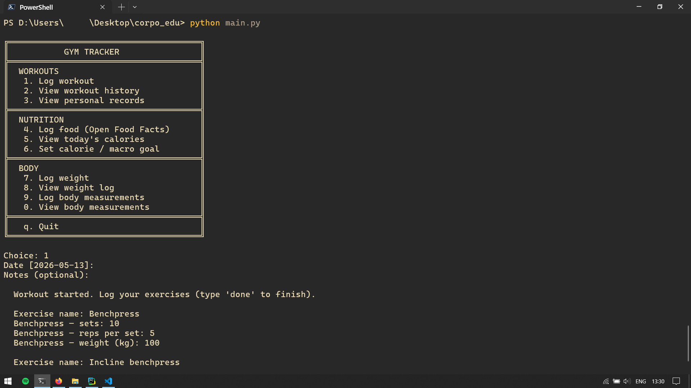

# corporalis_edu

A terminal-based fitness and calorie tracking application built with Python and SQLite. Log workouts, track body measurements, monitor your nutrition, and watch your personal records fall — all from the command line.

---

## Features

- **Workout Logging** — Record exercises, sets, reps, and weights; view full session history and individual workout details
- **Personal Records** — Automatically detected and updated whenever you beat a previous best
- **Body Measurements** — Track stats like waist, chest, arms, and more over time
- **Calorie Counting** — Search real foods via the [Open Food Facts](https://world.openfoodfacts.org/) API, log meals, and set daily calorie goals
- **Weight Tracking** — Log your bodyweight with 7-day and 30-day trend analysis

---

## Project Structure

```
corporalis_edu/
├── main.py                    Entry point, menu loop
├── db.py                      SQLite setup, schema init
│
├── api/
│   └── food_search.py         Open Food Facts search + parse
│
├── models/
│   ├── workout.py             Log and fetch workouts
│   ├── measurements.py        Body measurements
│   ├── records.py             Auto-update personal records
│   ├── calories.py            Food log, daily totals, goals
│   └── weight.py              Weight log, 7/30-day trends
│
├── views/
│   ├── workout_view.py        Log workout, history, detail
│   ├── measurements_view.py   Log and view body stats
│   ├── stats_view.py          Personal records table
│   ├── calorie_view.py        Food search, daily summary
│   └── weight_view.py         Log weight, trend display
│
└── data/
    └── gym.db                 SQLite database (auto-created)
```

---

## Requirements

- Python 3.8+
- `requests` (for Open Food Facts API)

Install dependencies:

```bash
pip install requests
```

---

## Getting Started

```bash
# Clone the repository
git clone https://github.com/vll4di/corporalis_edu.git
cd corporalis_edu

# Install dependencies
pip install requests

# Run the app
python main.py
```

The SQLite database (`data/gym.db`) is created automatically on first run — no setup required.

---

## Usage

On launch, you'll be presented with a menu to navigate the app's main modules:

| Option | Module | Description |
|---|---|---|
| 1 | Workouts | Log a session or browse history |
| 2 | Personal Records | View your all-time bests |
| 3 | Measurements | Log and review body stats |
| 4 | Calories | Search foods and track daily intake |
| 5 | Weight | Log bodyweight and view trends |


---

## Screenshots

### Main Menu / Workout Logging




## Data & Privacy

All data is stored locally in `data/gym.db` (SQLite). Nothing is sent to any server except outbound food searches to the Open Food Facts API.

---

## License

MIT
